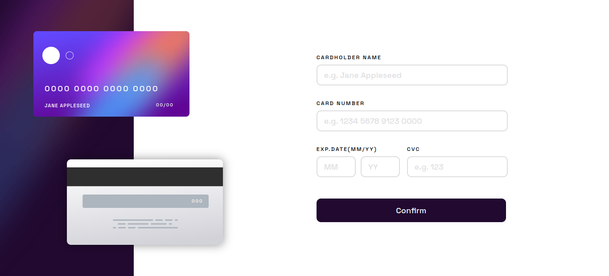
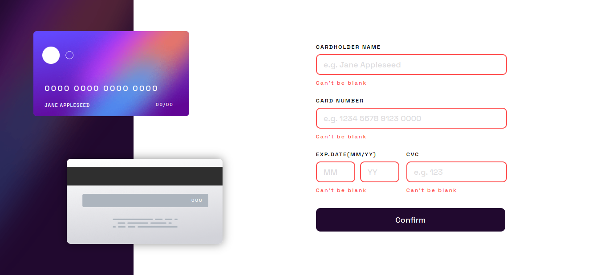
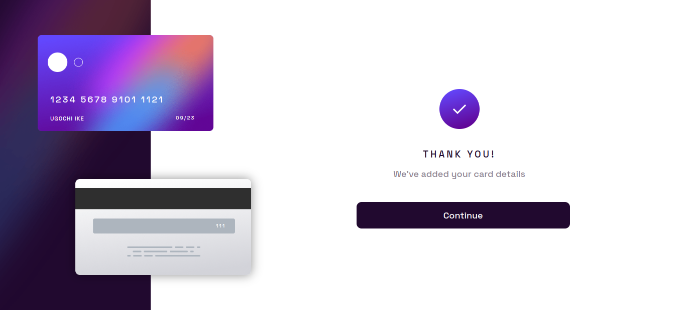

# Interactive card details form

## Table of contents

- [Overview](#overview)
  - [The challenge](#the-challenge)
  - [Screenshot](#screenshot)
  - [Links](#links)
- [My process](#my-process)
  - [Built with](#built-with)
  - [What I learned](#what-i-learned)
  - [Continued development](#continued-development)
- [Author](#author)

## Overview

### The challenge

Users should be able to:

- Fill in the form and see the card details update in real-time
- Receive error messages when the form is submitted if:
  - Any input field is empty
  - The card number, expiry date, or CVC fields are in the wrong format
- View the optimal layout depending on their device's screen size
- See hover, active, and focus states for interactive elements on the page

### Screenshot

#### Desktop view



#### Error validation



#### Thankyou view



### Links

- Live Site URL: [Live Site](https://noneofurbuzz.github.io/interative-card-details-form/)

## My process

### Built with

- Semantic HTML5 markup
- Flexbox
- CSS Grid
- Mobile-first workflow
- Vanilla javascript

### What I learned

It's okay if something doesn't look perfect.

I think in this project I really struggled with trying to make everything look perfect and it took someone to tell me that I was wasting time trying to make everything perfect when it was good enough as it was already.

Sometimes, good enough is okay.

#### CSS

It was hard at first to get the elements to position on the card properly so i had to use the position elements for that.

I definetely feel like i've learnt a lot about posiitioning particularly absolute and relative positioning.

It encountered some difficulties transitioning from mobile to desktop version with regards to positioning.

#### HTML

I tried to implement semantic HTML and I feel like I definetely implemented it better than previous projects but I still have a lot of work to do in terms of semantic HTML. 
For all the elements such as card number, cvc, month, year and card name, I used:

```html
<input type = "text">
```
I decided to prevent the user from entering more than the required value by using `maxlength`.

It was fun to work with different inline javascript functions in the HTML elements such as `onkeyup`,`onkeydown`, `onfocus` and so on.

#### Vanilla javascript

This definetely took the most amount of time for me. I spent a lot of time with validation and the more I fixed something, the more i saw something to fix.

A lot of if statements were used.

A lot of logic was used to make sure that as a user is deleting an input, it replaces it back with a zero.

For some reason `maxlength` wasn't working for `<input type = "text" name = "cardholdername">` and I am yet to figure out the error so I had to restrict the number characters possible to enter using slicing.

I decided to use regex to restrict numbers from being entered in the cardholder name and to restrict letters from being entered in the fields that require only number. 

```js
input.value = input.value.replace(/\D/g,"");
```

### Continued development

- There are some bugs I couldn't fix and I plan to come back to this project and tackle those.

- I'm not happy with how the project looks on devices with a large height viewport and I hope to be able to figure out a design that tackles that.

## Author

- Linkedin - [Ugochi Ike](https://www.linkedin.com/in/ugochi-ike-0647aa244/)


